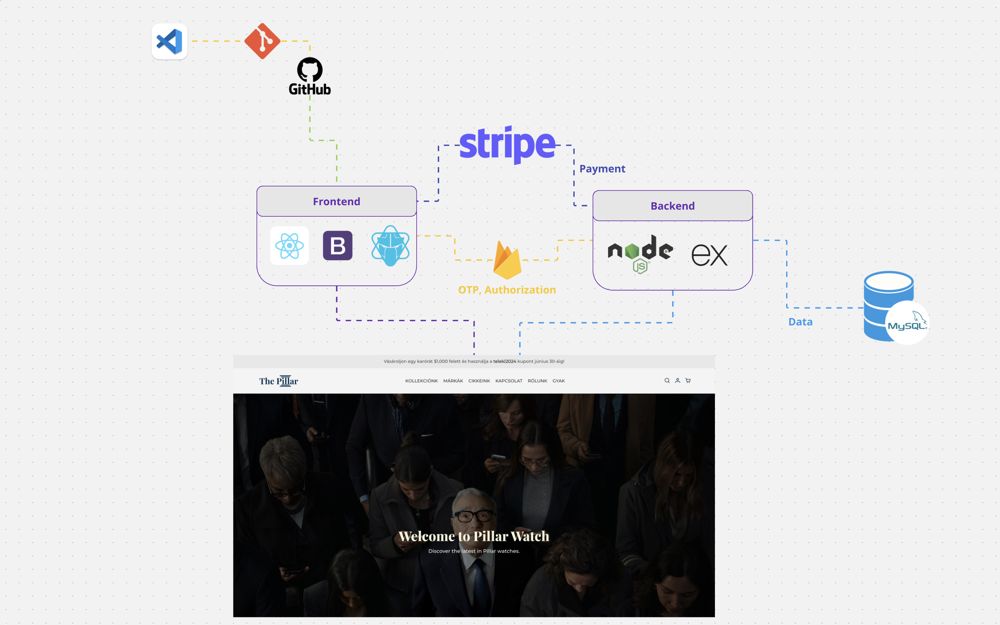

# The Pillar - Exclusive Watch Shop

The Pillar is an exclusive webshop specializing in luxury watches. Users can:

- Register and subscribe to newsletters
- Browse the catalog by brands
- Filter products based on various parameters
- Save favorite items
- Place orders and pay securely with a credit card
- Redeem discount coupons for special offers
- Authenticate using One-Time Passwords (OTP) via Firebase

## Key Features

### Backend
- Developed a **REST API** using:
  - **Node.js** and **Express.js** for server-side logic
  - **MySQL** for database management

### Frontend
- Built with **React.js**, following the **MVC architecture** for a clean and scalable design.

### Authentication
- Integrated **Firebase** for user authentication, enabling:
  - **One-Time Password (OTP)** login via email or phone number.
  - Secure and seamless user registration and authentication.

### Payment Processing
- Integrated the **Stripe API** to handle payments, enabling real-world transactions securely and efficiently.

## Challenges

One of the biggest challenges was implementing the complex filtering system, ensuring users could combine multiple criteria seamlessly while maintaining performance. Handling edge cases, such as no matching results or conflicting filter conditions, required a careful approach and thorough testing. 

Another significant challenge was ensuring the **order placement process** was reliable and consistent. This was achieved using SQL transactions, which guaranteed that all related database operations (e.g., updating inventory, recording the order, processing payment status) succeeded together or failed together, preventing any data corruption.

Overcoming these challenges involved extensive research, debugging, and collaboration to deliver a polished and user-friendly experience.

## What I Learned

- Gained experience in creating robust and performant filtering systems in a React.js frontend.
- Learned how to implement SQL transactions in MySQL to ensure data consistency for critical operations.
- Strengthened knowledge of integrating third-party APIs like Stripe for secure payment processing.
- Developed skills in debugging and optimizing backend processes for scalability and reliability.

## Snapshots (8)




## How to Run the Project

1. **Clone the repository**:
   ```bash
   git clone https://github.com/username/the-pillar.git